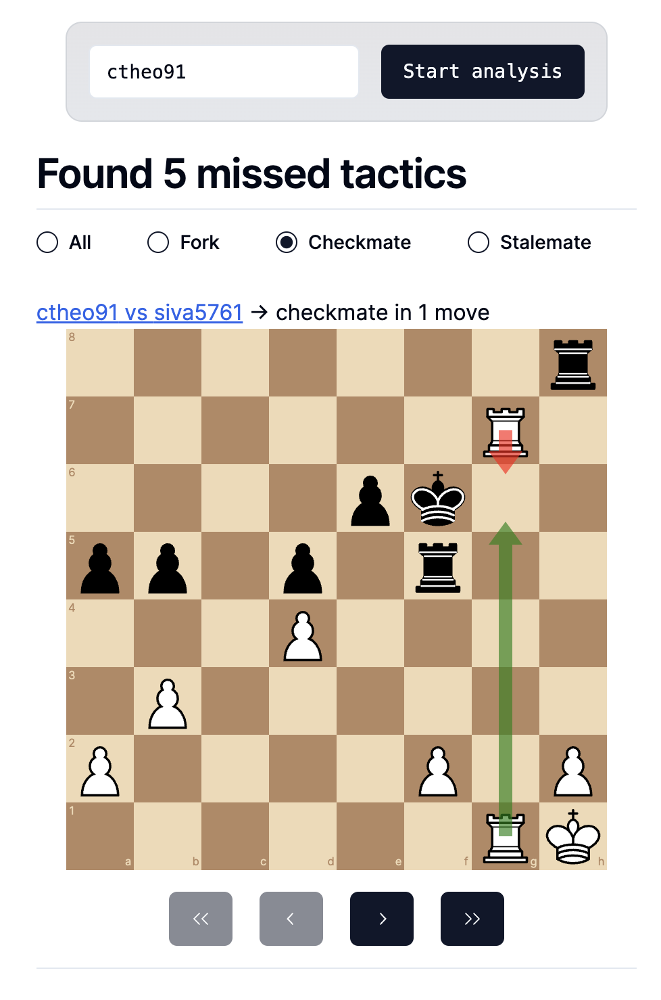

# Chess tactics trainer

[](https://GitHub.com/zatonix/chess-tactics-trainer/graphs/commit-activity)

[](https://GitHub.com/zatonix)
[](https://www.python.org/)
[](https://github.com/zatonix/chess-tactics-trainer)
[](https://github.com/zatonix/chess-tactics-trainer/blob/main/LICENSE)
[](https://GitHub.com/zatonix/chess-tactics-trainer/graphs/contributors/)
[](https://GitHub.com/zatonix/chess-tactics-trainer/commit/)
[](http://makeapullrequest.com)


## Description

This is a chess tactics trainer. It is a software for lichess game analysis and tactics training.




## Getting Started

### Dependencies

* Python >= 3.9
* node >= 18
* docker
* docker-compose

### Installing

```bash
cd api/
make init # to build api docker image

cd ../app
npm install # to install app dependencies
```

### How to Backend

```bash
cd api/
make run # to launch api
make test # to launch tests
make lint # to check linter
```

### How to Frontend

```bash
cd app/
npm run dev # to launch app
npm run build # to build app
npm run test # to launch tests
npm run lint # to check linter
```
