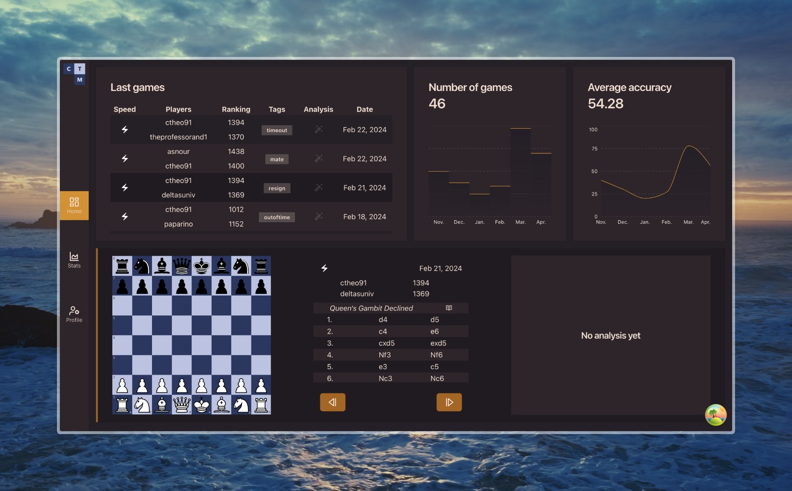

# Chess Tactics Manager

## Description

*Chess Tactics Manager* is an open-source web application designed for training and analyzing chess tactics. This application provides a unified platform to track and improve your chess skills by integrating game data from popular chess platforms such as Lichess.org and Chess.com.

### Features

	•	Integration with Chess Platforms: Import your games from Lichess.org and Chess.com to monitor your progress across both platforms in one place.
	•	Advanced Game Analysis: Leverage Stockfish 16 and our custom analysis tools to deeply analyze your games. Our proprietary analysis engine helps identify missed tactical opportunities in the variations that emerge from your games.
	•	Interactive Training: The core of Chess Tactics Manager is its focus on game analysis. Users can launch comprehensive analyses of their games to uncover missed tactics and enhance their strategic understanding.
	•	Future Enhancements: Our goal is to evolve Chess Tactics Manager into a comprehensive training hub. Future updates will include personalized insights into your games and custom exercises tailored to your learning needs.

Join us in enhancing your chess skills and contributing to the open-source chess community!

## Contributing

We welcome contributions from the community. Please refer to our contributing guidelines to learn how you can get involved.

## License

Chess Tactics Manager is licensed under the MIT License.

Feel free to adjust the links and any other details to fit your project’s specifics!

## Dependencies

* node >= 18
* docker
* GCP
